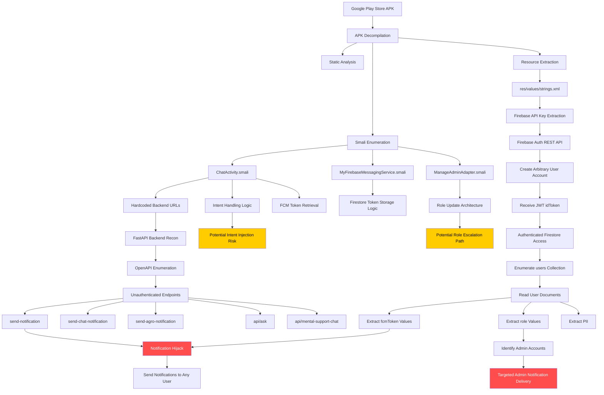
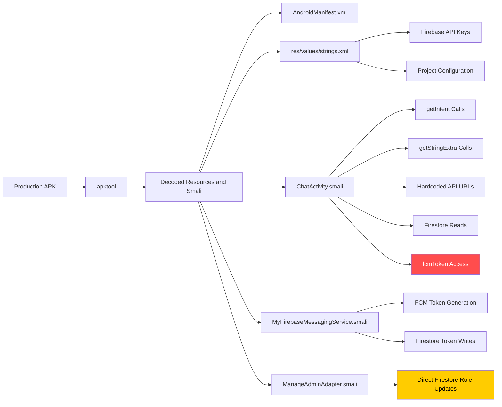
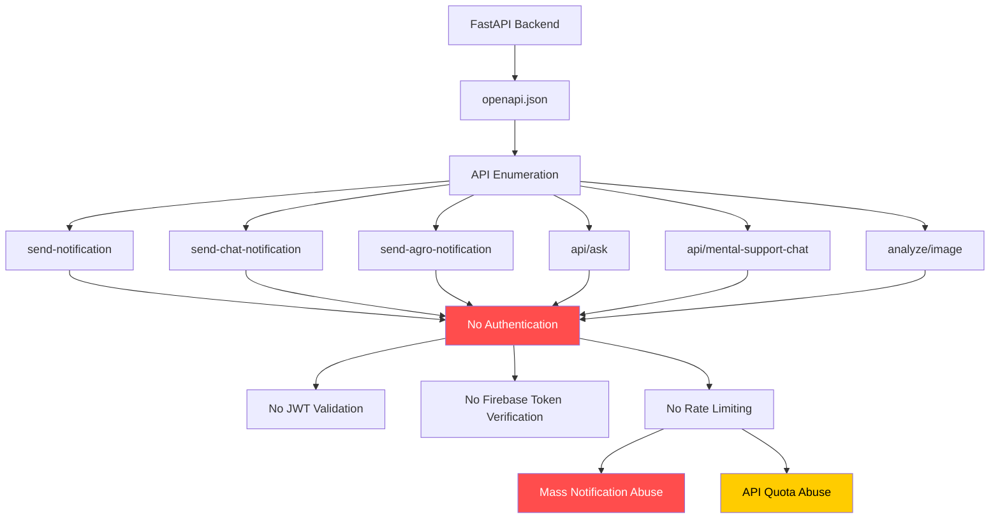
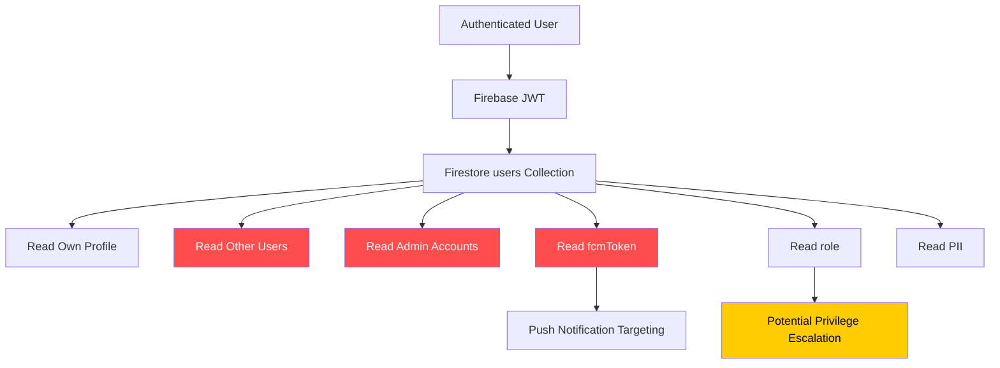
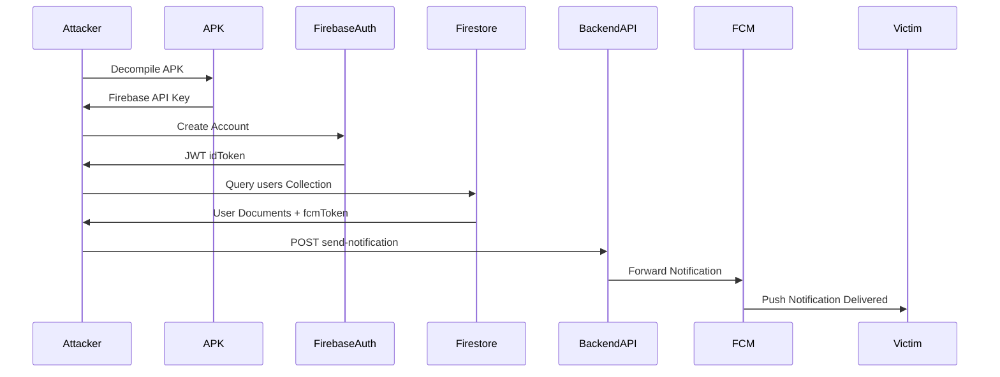
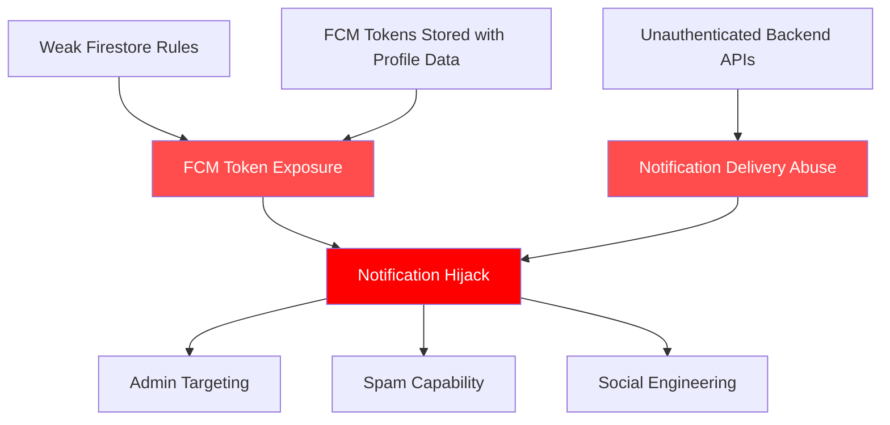
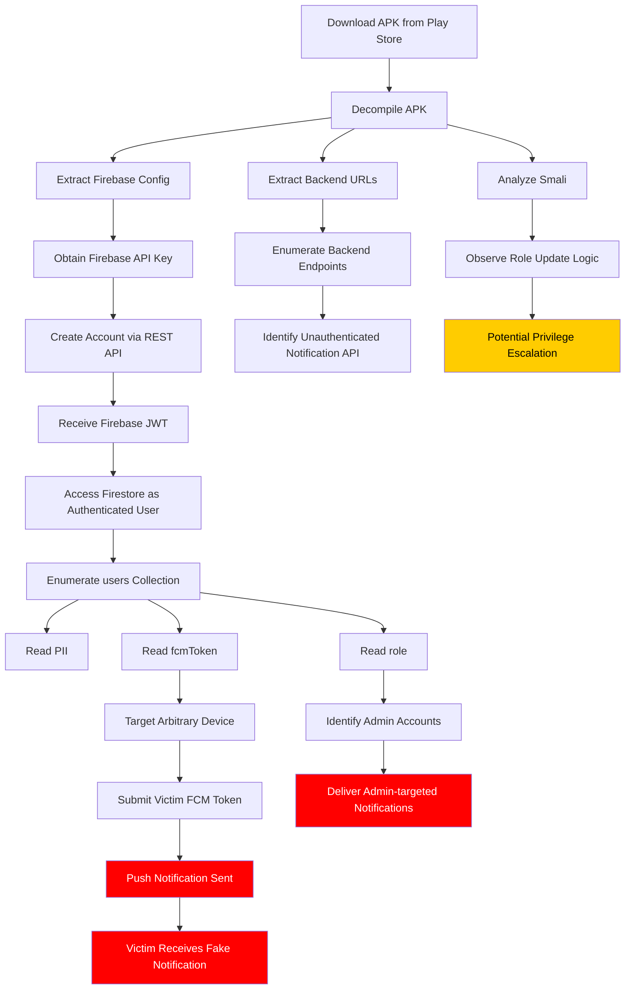

# Attack Chain Visualization

## High-Level Exploitation Flow

---

# APK Reverse Engineering Flow

---

# Backend Attack Surface Mapping

---

# Firestore Trust Boundary Failure

---

# Notification Hijack Flow

---

# Root Cause Relationship Map

---

# Full End-to-End Kill Chain

